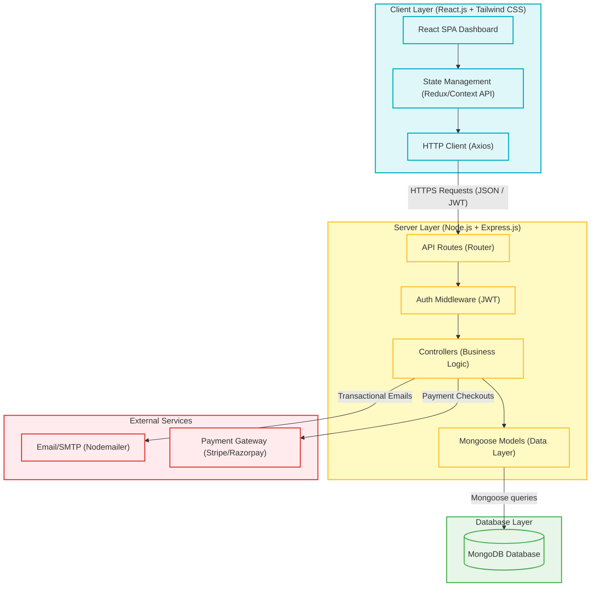
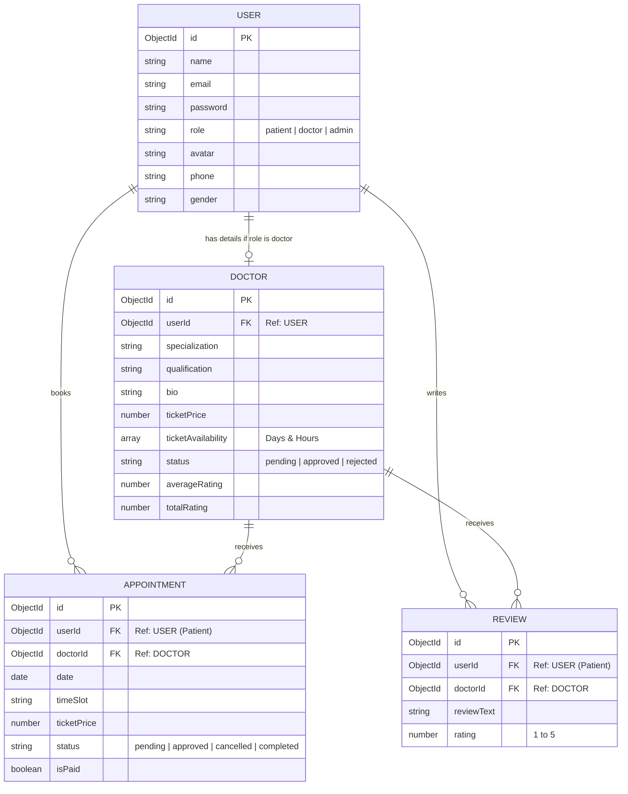
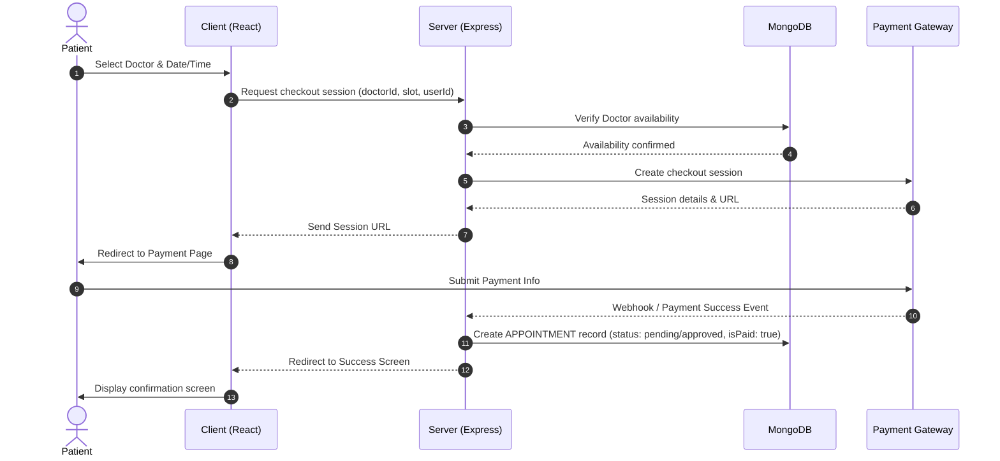
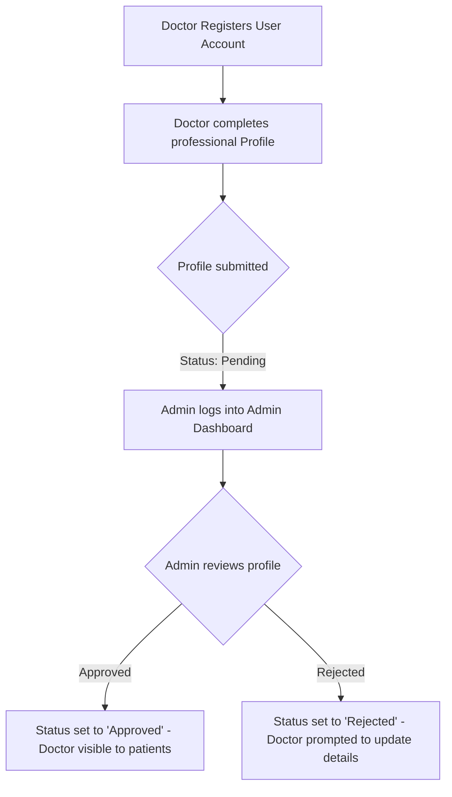

# HealHub: Doctor Booking Application Architecture

This document presents the comprehensive project architecture, database design, feature set, roles, and user flows for **HealHub**, a modern MERN-stack doctor booking application.

---

## 1. Technical Architecture

HealHub uses the **MERN (MongoDB, Express.js, React, Node.js)** stack. Below is the technical architecture diagram showing the relationship between the client, backend, database, and third-party integrations:



---

## 2. ER Diagram (Database Model)

The MongoDB database model features schemas for **Users**, **Doctors**, **Appointments**, and **Reviews**. Since MongoDB is document-based, we reference relationships using ObjectIDs.



---

## 3. Features

### Patient Features
*   **Authentication & Profile**: Signup, login (with secure passwords), and profile updates (avatar upload, gender, contact info).
*   **Doctor Search & Filter**: Search doctors by name, specialization, or filter by rating/price.
*   **Booking System**: Choose available time slots and schedule appointments.
*   **Ratings & Reviews**: Give feedback and ratings (1–5 stars) to doctors after consultations.
*   **My Bookings**: View booking history, booking status (pending/approved), and payment receipts.

### Doctor Features
*   **Application & Onboarding**: Fill out professional profiles (bio, qualifications, pricing, specializations, schedule) for admin approval.
*   **Dashboard**: View daily scheduled appointments, pending requests, total earnings, and reviews.
*   **Time Management**: Define and update work hours and availability slots.

### Admin Features
*   **Dashboard Analytics**: Overview of total users, active doctors, overall earnings, and appointments.
*   **Doctor Verification**: Approve/reject pending doctor applications.
*   **User & Review Management**: Monitor system reviews and manage patient/doctor accounts.

---

## 4. Roles and Responsibilities

| Role | Responsibilities | Key Actions | Access Level |
| :--- | :--- | :--- | :--- |
| **Patient** | Manages personal health profile, finds care, and reviews doctors. | Search, book appointments, make payments, write reviews. | Standard |
| **Doctor** | Manages availability, details, and schedules. | Set availability, view dashboards, accept/reject consultations. | Elevated |
| **Admin** | Moderates platforms, handles verification, and oversees analytics. | Approve/reject doctors, manage listings, view metrics. | Administrator |

---

## 5. User Flows

### A. Appointment Booking Flow (Patient Perspective)


### B. Doctor Onboarding & Approval Flow


---

## 6. MVC (Model-View-Controller) Pattern

The backend is structured around the classic **MVC pattern** (with React serving as the "View" layer, and Node/Express representing the "Controller" and "Model" layers):

```
backend/
├── config/             # Configuration files (Database connection)
├── controllers/        # Controllers (Handles requests/responses and logic)
│   ├── authController.js
│   ├── userController.js
│   ├── doctorController.js
│   └── bookingController.js
├── models/             # Mongoose Models (Defines database schema structures)
│   ├── User.js
│   ├── Doctor.js
│   ├── Appointment.js
│   └── Review.js
├── routes/             # Routes (Maps URL endpoints to Controllers)
│   ├── auth.js
│   ├── users.js
│   ├── doctors.js
│   └── bookings.js
├── middleware/         # Middleware (Token verification, authorization roles)
│   └── authMiddleware.js
└── index.js            # Entry Point (Starts Express server)
```

### Core Architecture Responsibilities:
*   **Model**: Contains the schema validation logic and directly queries MongoDB via Mongoose.
*   **View (React Component)**: Renders the interface, reads the global state (Redux/Context), and fires requests via Axios.
*   **Controller**: Extracts parameters from the request, invokes models to fetch/update data, coordinates notifications/emails/payments, and returns JSON payloads.
